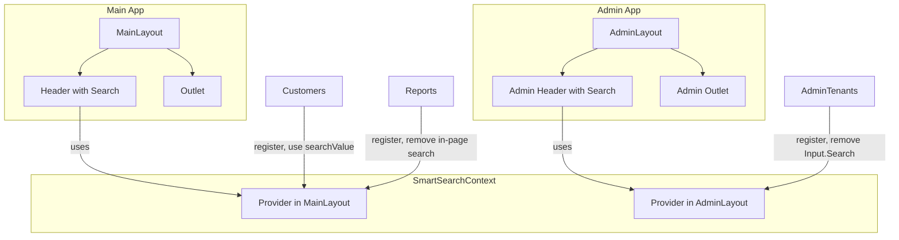

# Smart Header Search — All Pages, Single Global Search

## Overview

Implement a **context-aware header search bar** used by **all pages** across the app. The placeholder and behavior switch by route (e.g. "Search for customers", "Search for invoices"). **All in-page search inputs are removed** (Reports, Inventory, AdminTenants, etc.); the **header is the only search UI** for list/entity pages.

## Current State

- **Header** ([Header.jsx](Frontend/src/components/layout/Header.jsx)): Static placeholder "Search products, customers and transactions", no behavior.
- **MainLayout** renders `Header` + `Outlet` for main app; **AdminLayout** has its own header (no search today).
- **In-page search to remove:**
  - **Reports**: "Search for report" input + `reportSearchQuery` (client-side filter on saved reports) — [Reports.jsx](Frontend/src/pages/Reports.jsx) ~2669–2686.
  - **AdminTenants**: `Input.Search` (Ant Design) "Search by name or slug" — [AdminTenants.jsx](Frontend/src/pages/admin/AdminTenants.jsx) ~247–252. Per .cursorrules, replace with shadcn when adding header search.
  - **Inventory**: `handleSearch` + `filters.search`; fetch does not currently pass `search` but backend supports it. No dedicated search input in main UI; logic exists. Remove local search handling and use header.
- **Customers**: Has `searchText` / `debouncedSearchText` / `handleSearch`, API supports `search`; no visible search UI. Use header as the search UI.
- **Others**: Many list pages use `DashboardTable`; several backends support `search` (customers, invoices, leads, jobs, quotes, vendors, inventory, employees, users, accounting, shops, pharmacies, products, drugs). Expenses, Sales, Payroll do not expose `search`; use **client-side filtering** on loaded list data when we add header search there.

## Architecture

- **SmartSearchContext**: `pageConfig` (`{ scope, placeholder } | null`), `searchValue`, `setSearchValue`, `setPageSearchConfig`. Clearing `searchValue` when `pageConfig` changes.
- **Header** (MainLayout) and **Admin header** (new search block in AdminLayout): single controlled input; placeholder from context; `key` by scope so input resets on route change.
- **Pages**: Register on mount, unregister on unmount. Use `searchValue` + debounce for API or client-side filter. **Remove all in-page search UIs.**

- **Provider placement**: MainLayout and AdminLayout are **mutually exclusive** (different route trees). Use **two provider instances** — one in MainLayout, one in AdminLayout. Same `SmartSearchContext` / `useSmartSearch`; each layout has its own provider and header search block.

## Scope: All Pages

### Main app (MainLayout)

| Page | Placeholder | Backend search? | Remove in-page search? |
|------|-------------|------------------|------------------------|
| Dashboard | Search products, customers and transactions | — | No (default) |
| Customers | Search for customers | Yes | N/A (use header only) |
| Invoices | Search for invoices | Yes | No current UI |
| Leads | Search for leads | Yes | No current UI |
| Jobs | Search for jobs | Yes | No current UI |
| Quotes | Search for quotes | Yes | No current UI |
| Vendors | Search for vendors | Yes | No current UI |
| Inventory | Search for inventory | Yes | Yes (drop handleSearch / filters.search usage; use header) |
| Employees | Search for employees | Yes | No current UI |
| Users | Search for users | Yes | No current UI |
| Expenses | Search for expenses | No | No current UI — **client-side filter** |
| Sales | Search for sales | No | No current UI — **client-side filter** |
| Payroll | Search for payroll | No | No current UI — **client-side filter** |
| Pricing | Search for pricing | — | No current UI |
| Accounting | Search for accounting | Yes | No current UI |
| Reports | Search for reports | No (client-side) | **Yes** — remove "Search for report" input + `reportSearchQuery` |
| Shops | Search for shops | Yes | No current UI |
| Pharmacies | Search for pharmacies | Yes | No current UI |
| Products | Search for products | Yes | No current UI |
| Drugs | Search for drugs | Yes | No current UI |
| Prescriptions | Search for prescriptions | — | No current UI |
| POS | — | — | Default placeholder only |
| Profile, Settings, Checkout | — | — | Do not register; default placeholder |

**Non-list pages** (Profile, Settings, Checkout, Onboarding, POS, etc.): Do **not** register. Header shows default placeholder.

### Admin (AdminLayout)

| Page | Placeholder | Remove in-page search? |
|------|-------------|------------------------|
| AdminTenants | Search tenants by name or slug | **Yes** — remove `Input.Search` |
| Others (Overview, Billing, Reports, Health, Settings) | Default placeholder | N/A |

- **AdminLayout**: Add a **search bar** to the admin header (shadcn `Input`), use `SmartSearchContext` from the **AdminLayout** provider. Only AdminTenants registers; others use default.

## Implementation Plan

### 1. SmartSearchContext

- **New file**: `Frontend/src/context/SmartSearchContext.jsx`
- State: `pageConfig` (`{ scope, placeholder } | null`), `searchValue`, `setSearchValue`.
- `setPageSearchConfig(config | null)`: when config changes (including to `null`), clear `searchValue`.
- Default placeholder: `"Search products, customers and transactions"`.
- Export `useSmartSearch()`.

### 2. MainLayout + Header

- **MainLayout**: Wrap content with `SmartSearchProvider`.
- **Header**: Use `useSmartSearch()`. Controlled input: `value={searchValue}`, `onChange` → `setSearchValue`. `placeholder` from `pageConfig` or default. `key={pageConfig?.scope ?? 'global'}`. Keep current layout/styling.

### 3. AdminLayout + Admin header search

- **AdminLayout**: Add `SmartSearchProvider` around admin content. Add a **search bar** in the admin header (reuse same pattern as main Header: shadcn `Input`, context-driven placeholder/value). No Ant Design `Input.Search`; use shadcn only.

### 4. Register all main-app list pages + remove in-page search

- **Customers, Invoices, Leads, Jobs, Quotes, Vendors, Inventory, Employees, Users, Accounting, Shops, Pharmacies, Products, Drugs**: Register with scope + placeholder; use `searchValue` + `useDebounce`; pass `search` to API where supported. Reset pagination when `searchValue` changes. **Inventory**: Remove `handleSearch` and any `filters.search`-based logic; drive search purely from header.
- **Expenses, Sales, Payroll**: Register; use `searchValue` + debounce; **client-side filter** on existing list data (no backend `search`).
- **Reports**: Register "Search for reports"; use `searchValue` to filter `savedReports` (replace `reportSearchQuery`). **Remove** the "Search for report" input and `reportSearchQuery` state.
- **Pricing, Prescriptions**: Register if they have list/search UIs; otherwise default placeholder.
- **Dashboard**: No registration; default placeholder. (Optional future: global search.)

### 5. AdminTenants

- Register with "Search tenants by name or slug". Use `searchValue` + debounce for tenant fetch. **Remove** `Input.Search` and `handleSearch`; replace with shadcn patterns if any remaining form controls.

### 6. Constants

- **Constants**: Add `SEARCH_PLACEHOLDERS` in [constants/index.js](Frontend/src/constants/index.js) (e.g. `GLOBAL`, `CUSTOMERS`, `INVOICES`, …) and use in context + page configs.

### 7. DataTable

- [DataTable](Frontend/src/components/ui/data-table.jsx) has optional `searchKey` / `searchPlaceholder`. It is **not** used by main list pages (they use `DashboardTable`). No change required unless a future page uses DataTable search; then that page would use header search instead.

## Removals Checklist

- [ ] **Reports**: Remove "Search for report" input block (~2669–2686), `reportSearchQuery` state, and filter using `reportSearchQuery`; switch to `searchValue` from context.
- [ ] **AdminTenants**: Remove `Input.Search` and `handleSearch`; use header search.
- [ ] **Inventory**: Remove `handleSearch`, `filters.search` usage; use header `searchValue` and pass `search` in `inventoryService.getItems` params.

## Edge Cases

- **Navigation**: Config change (including unregister) clears `searchValue`; new page starts with empty search.
- **Debouncing**: In pages, not in header. Use `useDebounce` and `DEBOUNCE_DELAYS.SEARCH`.
- **Onboarding** "Search shop types" / "Search country": In-form **dropdown filters**, not list search. **Do not remove**; out of scope for this change.

## Files to Create

| File | Purpose |
|------|---------|
| `Frontend/src/context/SmartSearchContext.jsx` | Context, provider, `setPageSearchConfig`, `searchValue` / `setSearchValue`, default placeholder |

## Files to Modify

| File | Changes |
|------|---------|
| [MainLayout.jsx](Frontend/src/layouts/MainLayout.jsx) | Add `SmartSearchProvider` |
| [Header.jsx](Frontend/src/components/layout/Header.jsx) | Use context; controlled search input with `key` |
| [AdminLayout.jsx](Frontend/src/layouts/AdminLayout.jsx) | Add `SmartSearchProvider`; add header search bar (shadcn) |
| [Customers.jsx](Frontend/src/pages/Customers.jsx) | Register, use `searchValue` + debounce, remove local search state |
| [Invoices.jsx](Frontend/src/pages/Invoices.jsx) | Register, add `search` to fetch, use `searchValue` + debounce |
| [Leads.jsx](Frontend/src/pages/Leads.jsx) | Register, wire `search` to API, use `searchValue` + debounce |
| [Jobs.jsx](Frontend/src/pages/Jobs.jsx) | Register, wire `search` to API, use `searchValue` + debounce |
| [Quotes.jsx](Frontend/src/pages/Quotes.jsx) | Register, wire `search` to API, use `searchValue` + debounce |
| [Vendors.jsx](Frontend/src/pages/Vendors.jsx) | Register, wire `search` to API, use `searchValue` + debounce |
| [Inventory.jsx](Frontend/src/pages/Inventory.jsx) | Register, pass `search` in fetch, use `searchValue` + debounce; **remove** `handleSearch` and `filters.search` |
| [Employees.jsx](Frontend/src/pages/Employees.jsx) | Register, wire `search` to API, use `searchValue` + debounce |
| [Users.jsx](Frontend/src/pages/Users.jsx) | Register, wire `search` to API, use `searchValue` + debounce |
| [Expenses.jsx](Frontend/src/pages/Expenses.jsx) | Register, **client-side filter** by `searchValue` |
| [Sales.jsx](Frontend/src/pages/Sales.jsx) | Register, **client-side filter** by `searchValue` |
| [Payroll.jsx](Frontend/src/pages/Payroll.jsx) | Register, **client-side filter** by `searchValue` |
| [Accounting.jsx](Frontend/src/pages/Accounting.jsx) | Register, wire `search` where supported, use `searchValue` + debounce |
| [Reports.jsx](Frontend/src/pages/Reports.jsx) | Register; **remove** "Search for report" UI + `reportSearchQuery`; filter by `searchValue` |
| [Shops.jsx](Frontend/src/pages/Shops.jsx) | Register if list page, same pattern |
| [Pharmacies.jsx](Frontend/src/pages/Pharmacies.jsx) | Register if list page, same pattern |
| [Products.jsx](Frontend/src/pages/Products.jsx) | Register if list page, same pattern |
| [Drugs.jsx](Frontend/src/pages/Drugs.jsx) | Register if list page, same pattern |
| [Prescriptions.jsx](Frontend/src/pages/Prescriptions.jsx) | Register if list page, else default |
| [Pricing.jsx](Frontend/src/pages/Pricing.jsx) | Register if list page, else default |
| [admin/AdminTenants.jsx](Frontend/src/pages/admin/AdminTenants.jsx) | Register; **remove** `Input.Search`; use header search |
| [constants/index.js](Frontend/src/constants/index.js) | Add `SEARCH_PLACEHOLDERS` |

## Summary

- **All** list/searchable pages use the **header search** (main or admin). Placeholder and behavior are **context-aware** by route.
- **All** in-page search inputs are **removed** (Reports, AdminTenants, Inventory’s search handling). The header is the **only** search UI for those flows.
- **Main app** and **admin** each have their own `SmartSearchProvider` and header search block; same context contract, two instances.
